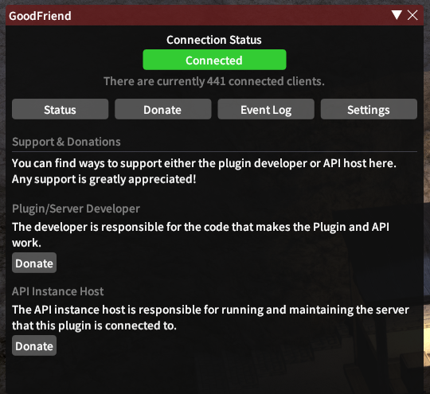
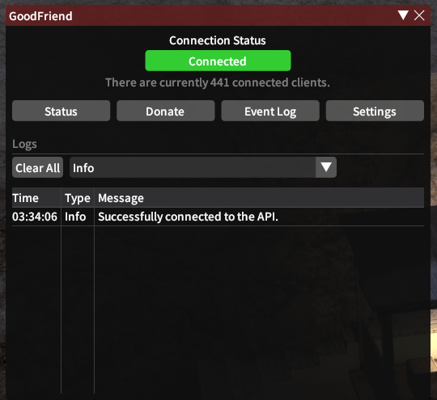
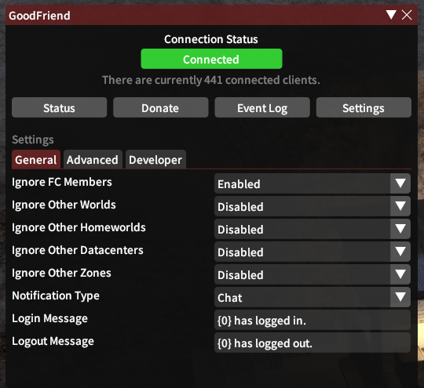

<!-- Repository Header Begin -->

  
### Good Friend
A server/plugin tool for supercharging friend functionality to players in-game without in-game polling.

**[Issues](https://github.com/BitsOfAByte/GoodFriend/issues) · [Pull Requests](https://github.com/BitsOfAByte/GoodFriend/pulls) · [Releases](https://github.com/BitsOfAByte/GoodFriend/releases/latest)**

---

<!-- Repository Header End -->

## About

GoodFriend is a plugin written for the [Dalamud](https://github.com/goatcorp/Dalamud) plugin framework which allows players to supercharge the in-game friends list capabilities and do things such as receive notifications when their friends login and logout.

This is achieved by utilising a custom-built API to work around some of the in-game limitations regarding friend data; essentially acting as a "relay" server between clients to protect individual privacy. Due to the nature of this design, most of the functionality provided by the plugin can only be utilised if both sides (e.g. another friend) is using the plugin.

The API is easily self-hostable with little work needed to get it going, just in-case anything ever happens to the official instance. The API could also be entirely rewritten in another language and still work with the plugin, as long as it inputs/outputs everything correctly.

### Features
- Quick friend notifications between GoodFriend users
- Powerful event filtering settings
- Easy to selfhost API with Docker
- Prometheus metrics built-in to API
- Privacy-focused design with unidentifiable event relaying
- Authentication support (bearer, basic) built into client
- Client localization support

### Screenshots
  

## Installing

This plugin can be downloaded from the official Dalamud plugins repository in-game by navigating to the plugin installer and searching for "GoodFriend". Once installed, you will be automatically connected to the official API instance and be ready to go without the need for any additional configuration.

If you would like to tweak any of the settings for the plugin you can do so by clicking the settings cog from the plugin list.

## 3rd-party API Instances

This plugin allows for 3rd party API instances to be used instead of the official instance provided here. It is highly recommended you stick to the official instance, as any 3rd party instance could potentially be dangerous, either by being insecure or actively abusing security vulnerabilities.

If you still wish to connect to a third party instance, simply put the URL to the API into the "API URL" option and restart the plugin; as long as the server and plugin match route versions and everything server-side is configured properly, you should be good to go.

## Technical Details
**"Client"** refers to a user that is running the plugin.
**"Server"** refers to the given API instance
**"Clients"** refers to all users of the given API instance.

A general flow of how this plugin would provide a login notification is as follows:
1. **Client** subscribes the server event stream to receive all events for other users.
2. **Client** logs into a character, the plugin hashes their ID and sends a PUT request to the **server** with the relevant information.
3. **Server** distributes the information received from the PUT request to all **clients** listening for events.
4. **Clients** will receive the information and attempt to match all friends' hashes against the received ContentID.
5. **Clients** that successfully match the ID to a friend will then display a notification for the event.

### Security & Privacy Considerations

Security and privacy was greatly considered during design and as such both the plugin and the server implement some methods to ensure the safety and privacy of all users, some examples are:

- No identifying information about the client is stored on the server, and any sensitive or identifying data passed through the server is hashed before arrival.
- Additional salting is applied client-side wherever possible, using things like the plugin assembly manifest and the user's friendship code to make sure the hash is harder to reverse.
- The client will not accept any data from the server that does not match the expected format, and will do it's best to secure the end user from any malicious attacks with warnings.
- The official server instance enforces strict rate-limiting to prevent abusive requests.
- The official server is hosted inside a containerized environment with strict security policies, and all communication is encrypted using TLS.
- The plugin will automatically disconnect from any unnecessary API event streams as soon as possible.
- All interactions with the server are stored in the event log for easy auditing.

## Contributions

### Code Changes
Contributions are welcome for the plugin as long as they remain in-scope and follow the Dalamud rules for submission. It is preferred you open an issue beforehand if you wish to work on something.

If you would like to set up a development environment it is preferred, but not required, to use the provided [Dockerfile](/.devcontainer/Dockerfile) and [development container](/.devcontainer/devcontainer.json) configuration with a compliant tool which will automatically handle installing all the required dependencies for you for both the plugin and the API.

### Translation & Localizations
If you wish to contribute localizations to this project, please do so over on the project [Crowdin](https://crwd.in/goodfriend).
